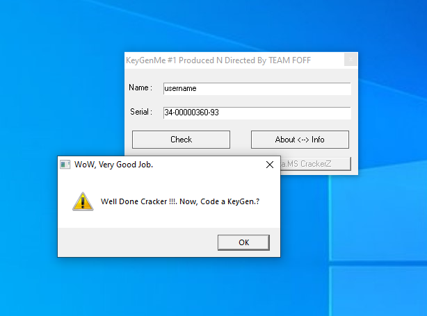
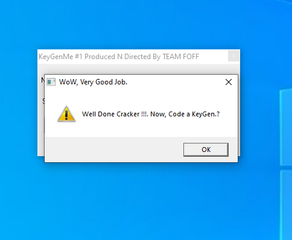

Hello Friends today i solved a crackme to solve this crack me is used 32dbg i will provide you link of this crack me on my github profile 

So first i downloaded the crackme me and unzip it and try to run it. While running it will ask for username and Serial key as shown in image below.


So I enterd some ramdom name and password after this  a message 
was shown we can see it in below 


Now let's reverse engineer this...

Now open in 32dbg and look the strings


so in the image we can see here some strings like wrong serial good job etc 
now look always before the successful messege good job etc 
you can go to add a break point or can go direct just click on the left of the string where you want to go 


in this image i clicked before the sucessfull messages i thought the algorithm start from here and found the stack frame 


here we can see the stack frame  and the algorithm will starting from here lets understand the algortithm and crack the password 

```
first added a break point here and restart the program and it ask for name and password and i enter random name and password and breakpoint was hit you can see the image below
 
```


now lets understands the first calculation what is happening here for better understanding i will right the code in easy way ...


```
so in the image you can see the block of code lets understands it 

xor eax,eax :-> eax = 0
xor edx,edx :-> edx = 0
mov ecx,10(10 is in hexadecimal): ecx = 0x10

mov al,byte ptr ds:[403254]:-> al = 'u'(stores the ascii value of u = 0x75)

div cl:-> ah = al%cl and al = al/cl
mov dl,ah-> dl = ah

note:-> for result see the values in registers 

```


```
so here al = 'u'-> 0x75
div cl -> (ah = al%cl) = (ah = 5) 
dl = ah = 5 
so edx = 5 
note:-> in 403235 it has -> "1AG4T3CX8ZF7R95Q" string you can see in dump 

al = byte ptr [edx+403235] :-> edx = 5 
al = (the value of 5th index ) = '3' 
dl = 'p' (first char of our password )

cmp al,dl 
so 3 is not equal to 5 so first char of our password will be 3 so now it will return to exit
so i will restart the program and enter first char 3 in password and after we understands the second calculation 
```


```
lets understand the second calculation 
see the image i given before it, I think same thing happening here like before 

eax = 0 
al = secondchar of username = username[1] = s(ascii value of s)
cl = 0x10 (ecx was not changed )
div cl -> (ah = al%cl and al = al/cl) 
note: see the value in registers 
dl = ah -> (dl = 3) 

note:->string pgs = "1AG4T3CX8ZF7R95Q"
al = pgs[dl]; -> 4
dl = second character of our password because now first is '3' remember 
dl = 'p'
cmp al,dl (al = '4' and dl = 'p')

we can say that our second char of password will be '4' 
so first two chars of our password = 34
so i will do samething will restart the program and enter it 


```


you can see here below 


let understands what is next :-> 


```
al = taking third char of our password(34password)
sub al,2D :-> al = al - 0x2D
jne :-> (leave and exit )means:->
if(al != 0x2D('-')){
    jmp at exit or leave
}
else{
    continue next 
    for continue next we should enter the third char '-' of our right password 
}
and subtracting  int al  0x2D(this is ascii value of hypen '-')
i think i got here the third char of our right password:-> 
so till now three chars of password -> 34-
now i will do the same restart the program and blah blah ...

```
let see what is happening next ...


here we can see a loop in the above image:->
```
  edx = 0
  eax = 0
  ecx = 0

  cl = first char of username = username[edx] = username[0] 
  or cl,cl 
  je then exit the loop:-> 
  add eax,ecx-> eax = eax + ecx
  inc edx 
  jmp on the loop again 

  here i am showing the code block in high level language so you can understands it better let see 

  cl = username[0]

   while((cl || cl) != 0){
    
     eax = eax + (int)cl :-> stroing the ascii of char in cl
     edx++
     cl = username[edx] 
      
  }
  int c/c++ code -> printf("%.8X",eax) = 00000360
  if you print this according to our username it will look like :-> see in register after the out of loop 

```
 
 

see here what is in eax = 00000360 (will be differ for every name)
so lets go next 


so you can see the images above at address[4032C0] has value of eax and address[4032A7] has skipped the 3 chars and the value is password 
and we can see here every byte of our password and 00000360 will be compare so we can run the entire loop if our password value = 00000360 so the next part of our password will be 00000360 

so password till now -> 34-00000360
i will restart the program and enter this to run the entire loop will meet out of the loop!

after restart the program:->


after the loop this is happening see in the image


al = 'p'
sub al,2D 
jne :-> so our p should be 0x2d if ascii value of '-' 
so we got next char of our right password!

i will restart the program :-> 
after restart 

lets see what is next we are so close to password !

in this image we can see that we have just solve this algorithm more so lets crack it understans what happening 
in this :-> i think this thing i did before :


see the register value after step over :->


you can see :-> 

```
   xor edx,edx :-> edx = 0
   mov ecx,10(int hexadecimal) :-> ecx = 0x10
   ebx = storing the length of our name in my case that is (username ) so len will be = 8 you can see in register 

   al = is storing the second last character of my name (username) = 'm'

   al = asccii of 'm' 
   cl = 0x10 
   div cl :-> ah = al%cl and al = al/cl 

   dl = ah 

   let see what will be in edx see the register after step over 
   note:-> (dl = 13)
   edx = 0xD = 13(in decimal) 
   pgs = "1AG4T3CX8ZF7R95Q"
   after it al = pgs[edx] = pgs[13] = '9'
   dl = 'p' 
   cmp al,dl 
   
   if we want to go next our p should be equal  = '9' 
   the next char of right password -> 9 
   i will again restart the program .....


```


after restarting the program->


look at this we are on final stage this is our last algo lets finish this and crack the password :->

 

```
ebx = 8 
xor eax,eax :-> eax = 0 
al = last char of username = 'e'= ascill value of e = 0x65 
cl = 0x10 = 16 
div cl (you know it now ) 
dl = ah (ah = al%cl) = 5

edx = 5
you can see in registers  
al = pgs[edx] = pgs[5] 
dl = 'p' 
cmp al,dl 
pgs = "1AG4T3CX8ZF7R95Q"
so the our right char will will pgs[5] = '3' at index 5 
our final password for:->

name = username 
password = 34-00000360-93

lets see varify it :-> 

```


lets check our pasword is right or not:->




bruh! i have cracked this you can see the message but now the most important thing to keygen so i'm provding the c++ code for kegen 

firstly i am varifying  my code :-> giving examples of two name and their passwords let see:-> 




name = ajay

password = AF-000001A5-AZ

yeah that working!

try someother example 

name = hacker

password = 8A-0000026E-3G


### c++ code for keygenerate!
```c

    #include<iostream>
    #include<math.h>
    #include<stdlib.h>
    using namespace std;

    int str_len(string str){
    int len = 0;
    
    while(str[len] != '\0'){

            len++;
    }    
        
    return len;
    }

    void generate_the_password(){

        cout<<"enter the username: ";
        string username;
        cin >> username;
        string password = "";
        string pass_genrator_string = "1AG4T3CX8ZF7R95Q";

    // happening two times so use loop:
    for(int i = 0; i<=1; i++){

        int cl = 0x10;
        char ch = username[i];
        int al = (int)ch;
        int dl = al%cl;  
        password.push_back(pass_genrator_string[dl]);
    }

        // inserting hypen in password our next character of right password 
        password.push_back('-');

        

        int edx = 0;
        int eax = 0;
        char ch1;
        ch1 = username[0];
        while((ch1 || ch1) != 0){

            eax = eax + ((int)ch1);
            edx++;
            ch1 = username[edx];      
        }

        cout<<"the password for given name:->  ";
        cout<<password;
        printf("%.8X",eax);
        printf("%c",'-');
        int cl = 0x10;
        int ebx = str_len(username);
        char second_last_char = username[ebx - 2];
        int al = (int)second_last_char;

        int dl = al%cl;
    

        //pass_genrator_string = "1AG4T3CX8ZF7R95Q";
        char new_ch = pass_genrator_string[dl];
        al = (int)pass_genrator_string[dl];
        cout<<new_ch;

        al = (int)username[str_len(username) - 1];
        cl = 0x10;
        dl = al%cl;
        char new_one_ch = pass_genrator_string[dl];
        cout<<new_one_ch;

    }

    int main(){

        generate_the_password();
        return 0;
    }   

```


<hr>

Connect me on [LinkedIn](https://www.linkedin.com/in/ajay-panchal-500a182aa/)


