hello viewers today i solved a easy crackme that is avelable at  crackmes.one. You can download it from [here](https://crackmes.one/crackme/5ab77f6633c5d40ad448cbe2)


To solve this crackme i used ida and 32dbg you can  download ida at hexrays.com 


Note: There is IsDebuggerPresent api in here, which checks if this program is running inside debugger. I used an plugin [ScyllaHide](https://github.com/x64dbg/ScyllaHide) as I wanted to focus on only reversing the algorithm.

<hr>

So first i downloaded the crackme me and unzip it and try to run it. While running it will ask for username and Serial key as shown in image below.

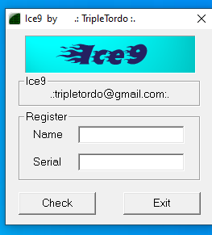

On entering Name and Serial it shows the message 

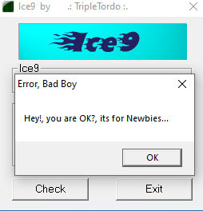

Now let's reverse engineer this...

Now open in IDA and look the strings

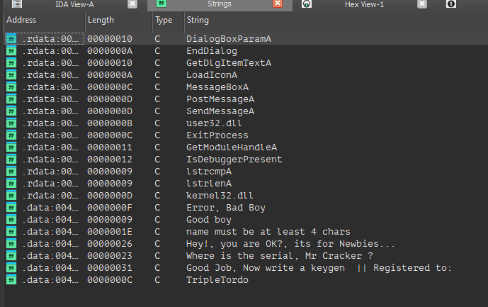

to view strings windows in IDA you can use shortcut (Shift + F12)

after i opend it in 32dbg and it look like this 
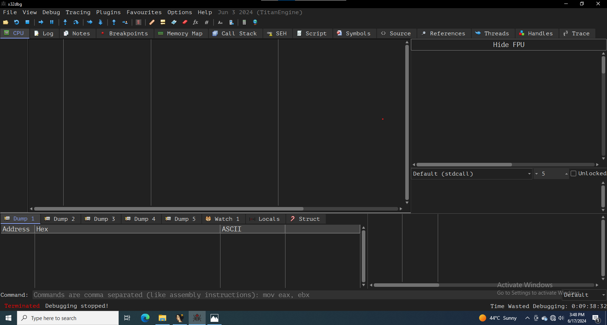

drag it in 32dbg 


now i searched for strings in 32dbg how i searched let see...

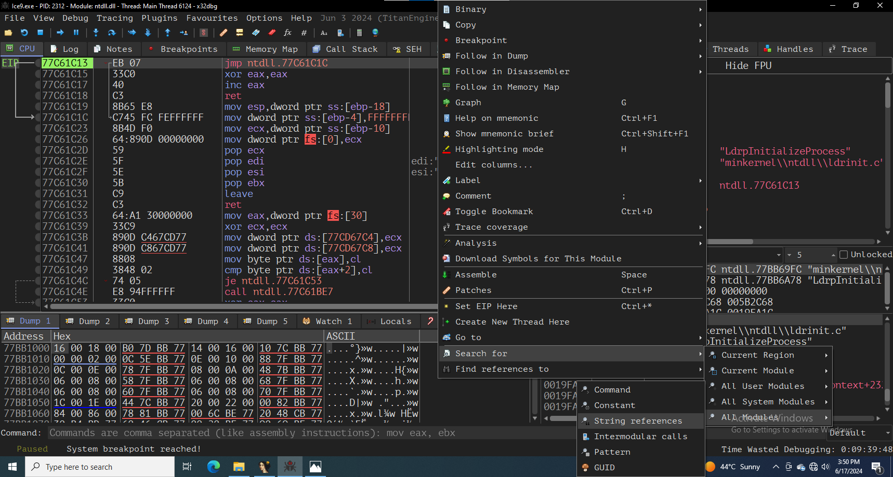

right click in cpu section and click on search for then click all module and click on string references when you click it look like this..

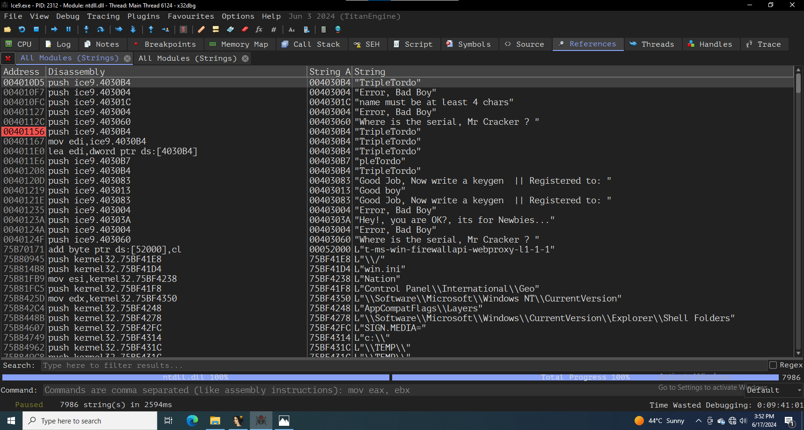

so now i added a break point at or you can go like this.


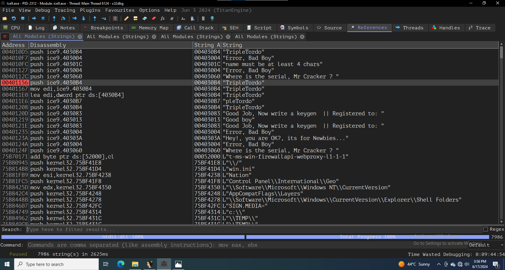

you can see below that good job msg has printed so the algorithm of passwrod will be before it so go to before just clikc on the selected part 
after click it looked like this..

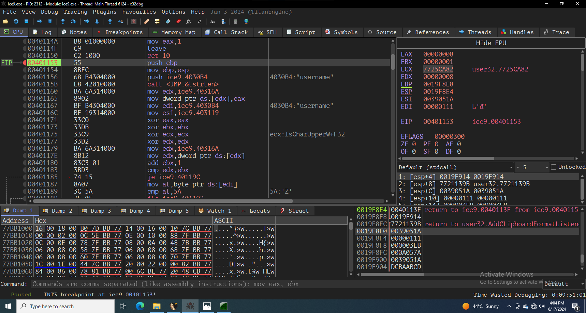

so add a break point 00401153 because here it is starting..

now restart the program you can press f9 or 
press (see in 32dbg how i did it )


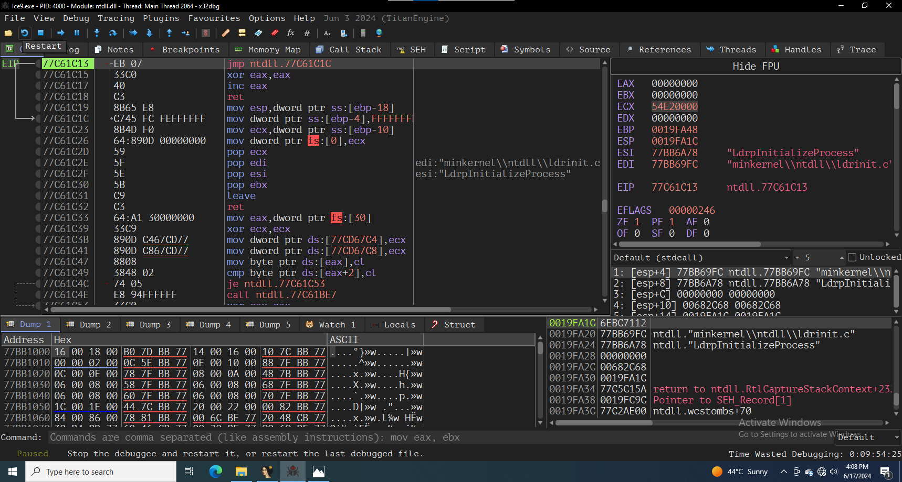

click on that round and after it click on this 2 times (->) and then it will you ask for name and passowrd enter it and run the porgram 
you will reach at where you  added the break point 

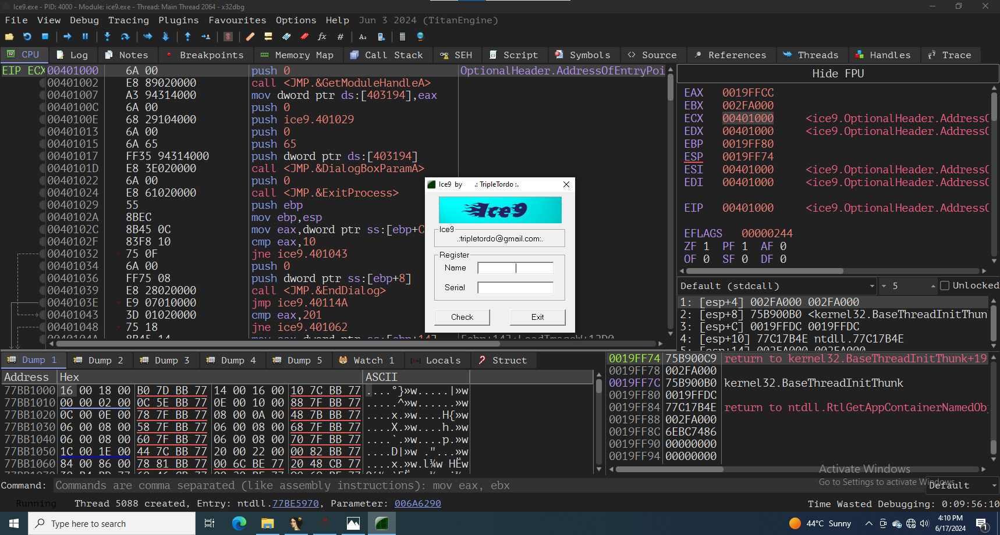

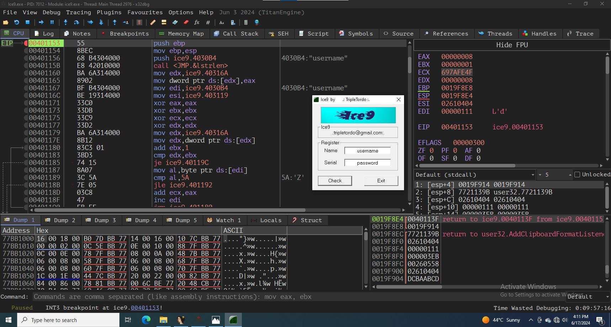

and now we can see here algorithm lets crack how i crack it (basically according to your username it will show you the password at the end if you will continue stepover  but important thing is that how i write my keygen program in c++ i will show you so now i will explain how algorithm working .. for stepover short cut key (f8))

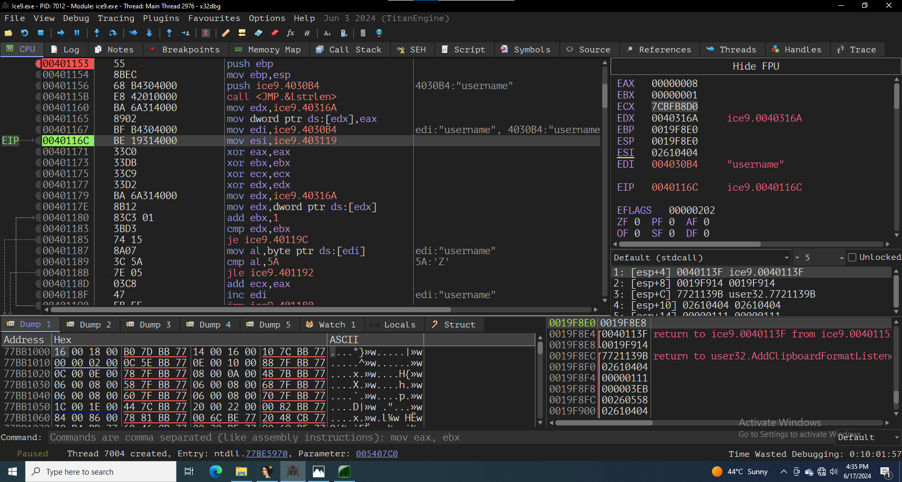
here a strlen function calls that calculates the length of our input username 

you can see right here registers where you can see what is happening in registers so our input has moves in (edi register)

now lets move next here you can see that the length moves into edx register (length of username = 8 you can count)

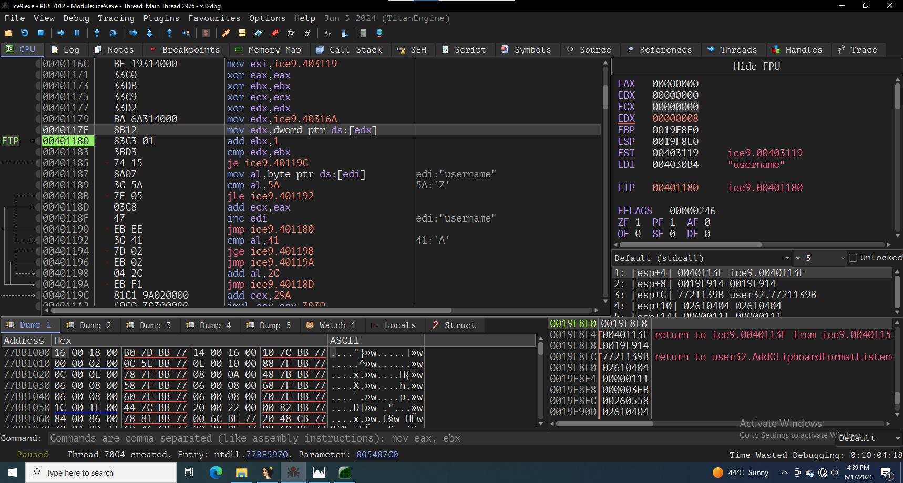
after next it here is we can see a loop ..
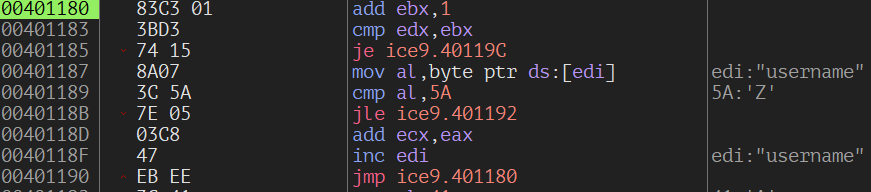

so in loop what is happening

in starting
```
ebx = 0 
edx = 8
```
and comparing edx and ebx if equal then jmp on any label otherwise mov byte of edi in al and comparing the byte with 'Z' if less than then jmp some label .. other wise add 
note:-> `al = u(al is lowest part of eax ) so eax = u`
it to `ecx (add ecx,eax )`
here i am showing a loop you can understand easily 
```
edi = "username";
int i = 0;
ebx = 0;
edx = 8;
int ecx = 0;

while(edx != ebx) {

    al = edi[i];
    note:-> enter only small letter in username because you can avoid multiple condition here the ascii value of small letter is greater than capital 
    if(al > 'Z'){
        ecx = ecx + al;
    }
    i++;
}
```
now continue to step over till edx == eax 
you will jmp here see in the picture

now i am out of loop:-> 
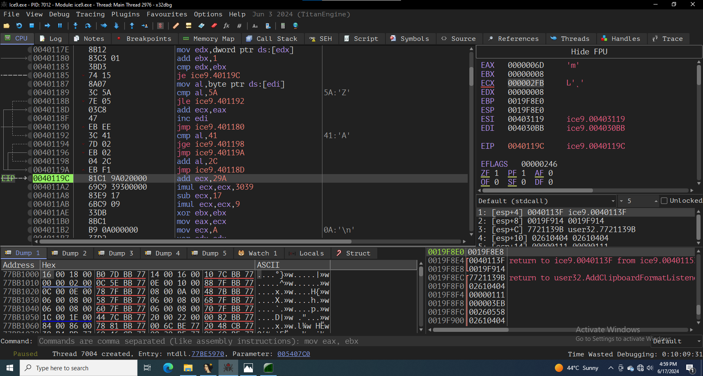
now here some happenig aithmetic calculations 
lets understands it 

so now ecx = 2FB see in registers 
add ecx,29A 

```
imul ecx,ecx,3039 ->( ecx = ecx *3039)

sub ecx,17 -> (ecx = ecx - 17) 

imul ecx,ecx,9-> (ecx = ecx*9) 
```

now step over and see what in ecx 
and other registeres 

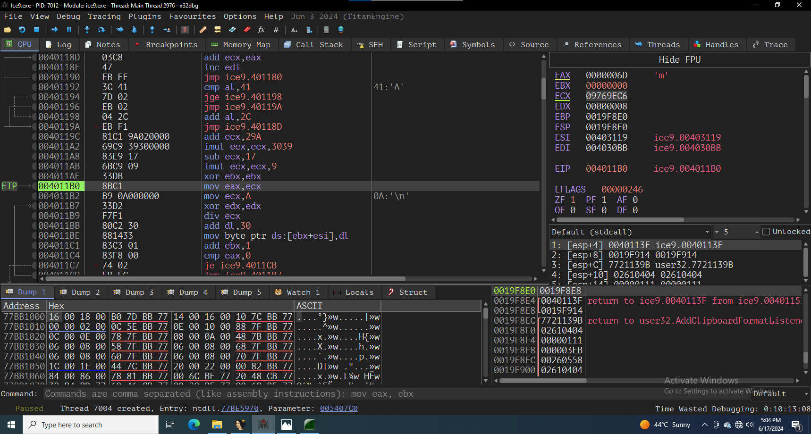

after it there is a one more loop we can see so lets understands it 
```
first mov ecx,A -> (ecx = 0xA = \n)  int decimal A = 10;
```

```
xor edx,edx -> (edx = 0) 
div ecx -> (qutoent -> eax = eax/ecx) 
div ecx -> (reminder-> edx = eax%ecx) 
```

first lets see what is in eax register do step over 
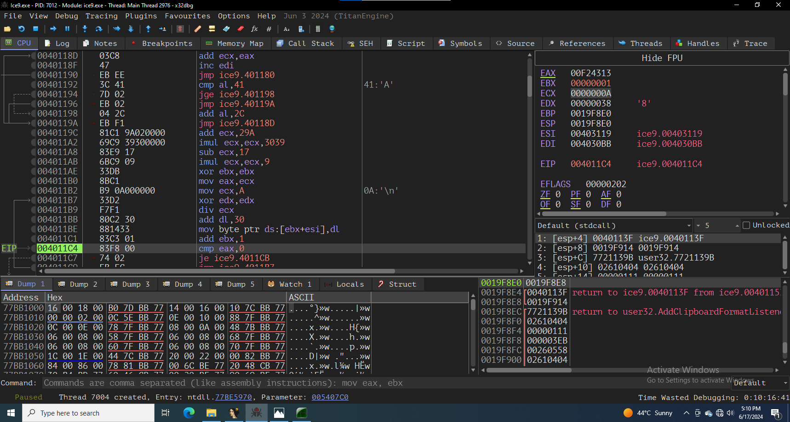

```
eax = 00F24313 
ecx = 10 
```

you can see loop here lets understand see below 

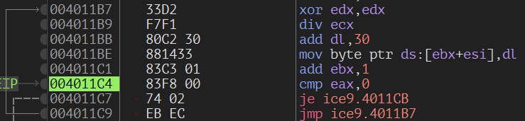

```c
first..
ebx = 0
ecx = 10 
eax = 00F24313 
esi = 0
string store = "";
while(eax != 0){

   edx = 0 
   // div ecx
   // div ecx -> eax = eax/ecx and edx = eax%ecx
   eax = eax/ecx  
   edx = eax%ecx 
   edx = edx + 0x30
   store[ebx + esi] = edx 
   ebx = ebx + 1


}

lets what is in store string after one iteration of loop 


```

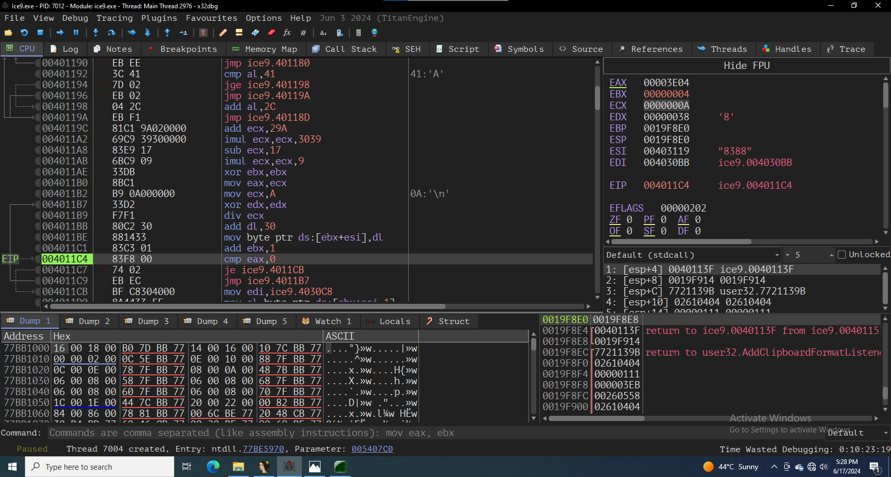
in esi register first 8 second 3 third store 8 and then 8 

after the out of loop lets what stores in esi 


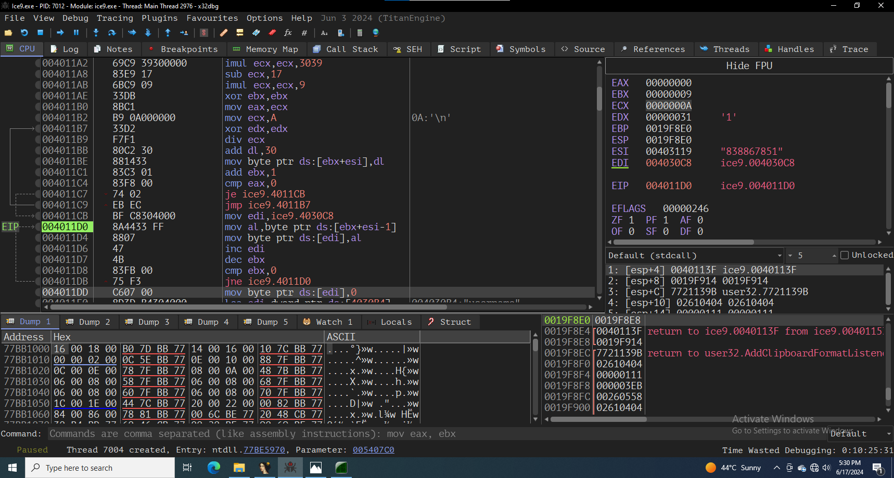 

esi = "838867851"

step over next  we found a one more loop lets understands it 

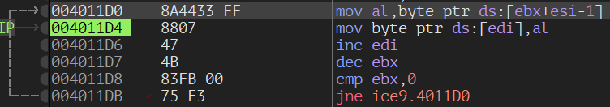 
so now ebx = 9 

actually this loop this loop is traversing esi in reverse order and storeing the byte (reversing the esi sting ) 

out of this loop lets see registers what happens 
step over ...

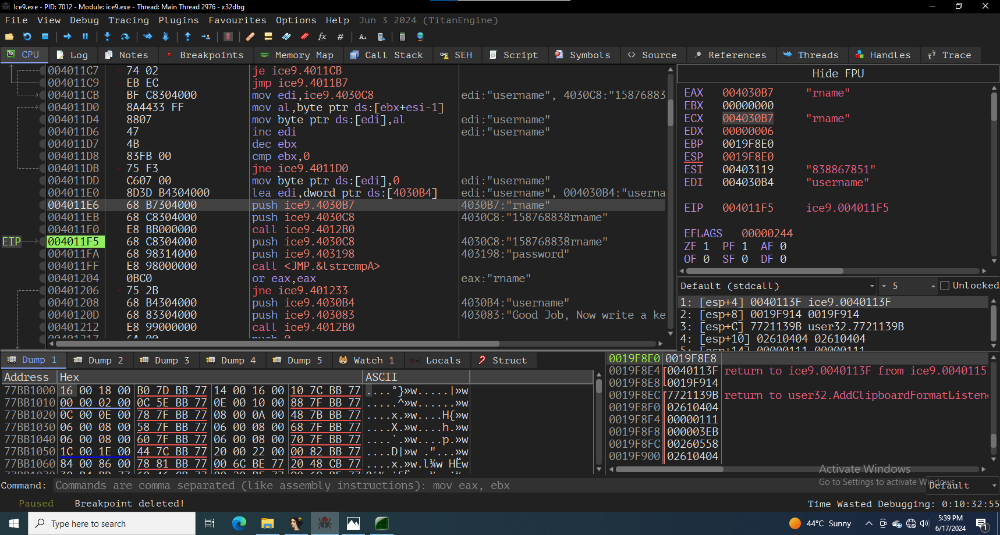


here in this picture we can see this  in below the password comparing with some other string 
ourpassword = password 
otherstring = 158768838rname (this is our actual password acc to our username )

esi = 838867851
otherstring = 158768838 
esi and otherstring are in reverse order 

so password = reverse of esi +  skip three letters of our urser name

note:-> here the value of esi will every time will be differ acc to our username we entered 

lets vrify this ...
username = username
password = 158768838rname

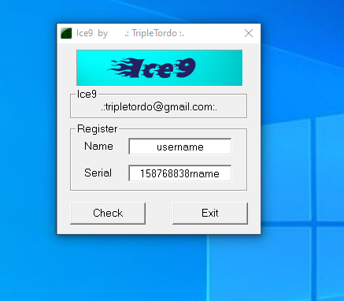
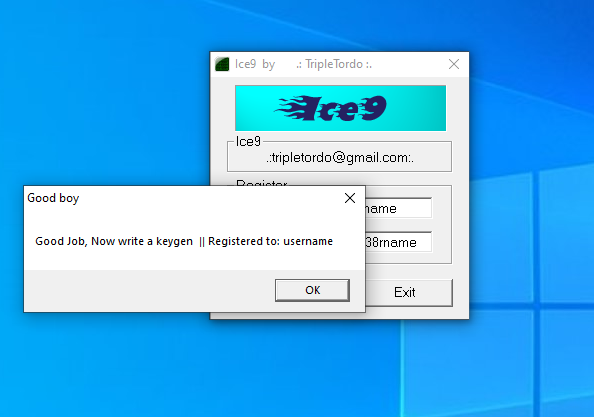


so we have got the passowrd 
but most important thing to generate keygen i generate keygen(enter name in only small letters then it will work and name should be at least 4 chars ) in c++ code that i will provide you in below

#### c++ code of kegen....

```C
#include<iostream>
#include<string>
#include<stdlib.h>
using namespace std;
int strlen(string str){

    int len = 0;
    int i = 0;
    while(str[i] != '\0'){

        len++;
        i++;
    }

    return len;
}
int main(){


// here you can compare by print (value in debugger or registers and value in this code )

// you can varify this c++ to generate the key acc to usrename (only valid for small letters name and atleast 4 chars username )

cout<<"enter the name"<<endl;
string _name;
cin >> _name;
int edx = strlen(_name);
int ebx = 1;
char al;
int index = 0;
int ecx = 0;

// first loop
while(edx != ebx){

  al = _name[index];
  if(al > 'Z'){    
      ecx = ecx + int(al);     
  }
  index++;
  ebx++;
}  

// arithmetic calculations 

ecx = ecx + 0x29A;
ecx = ecx*0x3039;
// printf("%x",ecx); 
ecx = ecx - 0x17;
// printf("%x",ecx);
ecx = ecx*9;
ebx = 0;

int eax;
// printf("%x",al);
eax = ecx;
// printf("%x",eax);

ecx = 0xA;
edx = 0;
string str = "";
int str_index = 0;
//second loop
while(eax != 0){

edx =  eax%ecx;
edx = edx + 0x30;
str[str_index] = edx;
str_index++;
eax = eax/ecx;

}
//  printf("%x",ecx);
al = 0;
ebx = 9;

string edi = "";
int esi = 0;
// third loop
// storing the str string in reverse order in edi (or you can reverse the esi string that will also work )
while(ebx != 0){

    al = str[ebx-1 + esi];
    edi = edi + al;
    
    ebx--;   

}

// generating password 
//  reverse string + skip the three chars username 
string password = "";

password = password + edi;
for(int i = 3; _name[i] != 0; i++){

    password = password + _name[i];
}

cout<<"username = "<<_name<<endl;
cout<<"password = "<<password<<endl;

return 0;
}


// i am giving one more example of my name to varify this code lets see 

```

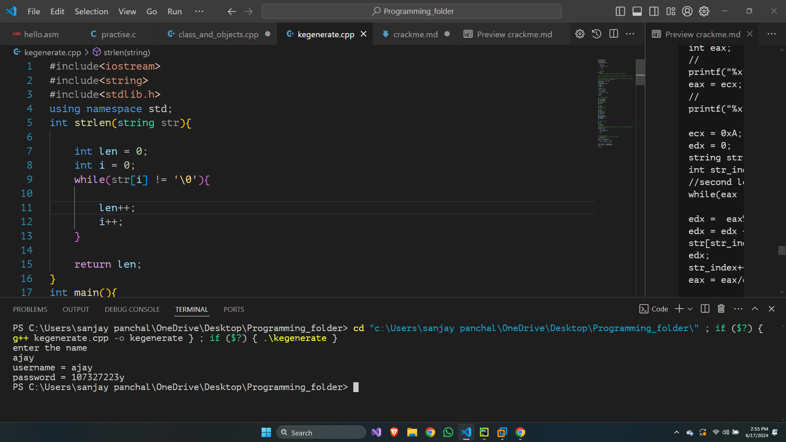

name = ajay
password = 107327223y


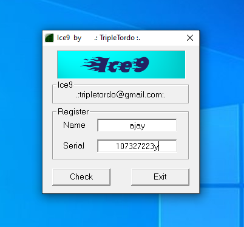

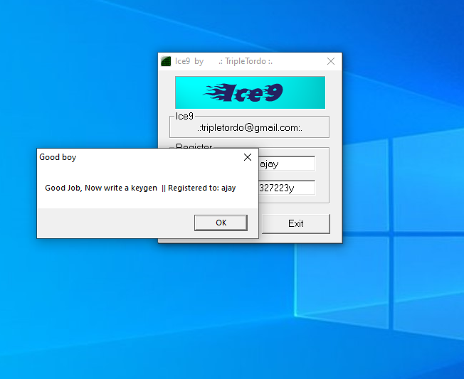

<hr>

Connect me on [LinkedIn](https://www.linkedin.com/in/ajay-panchal-500a182aa/)